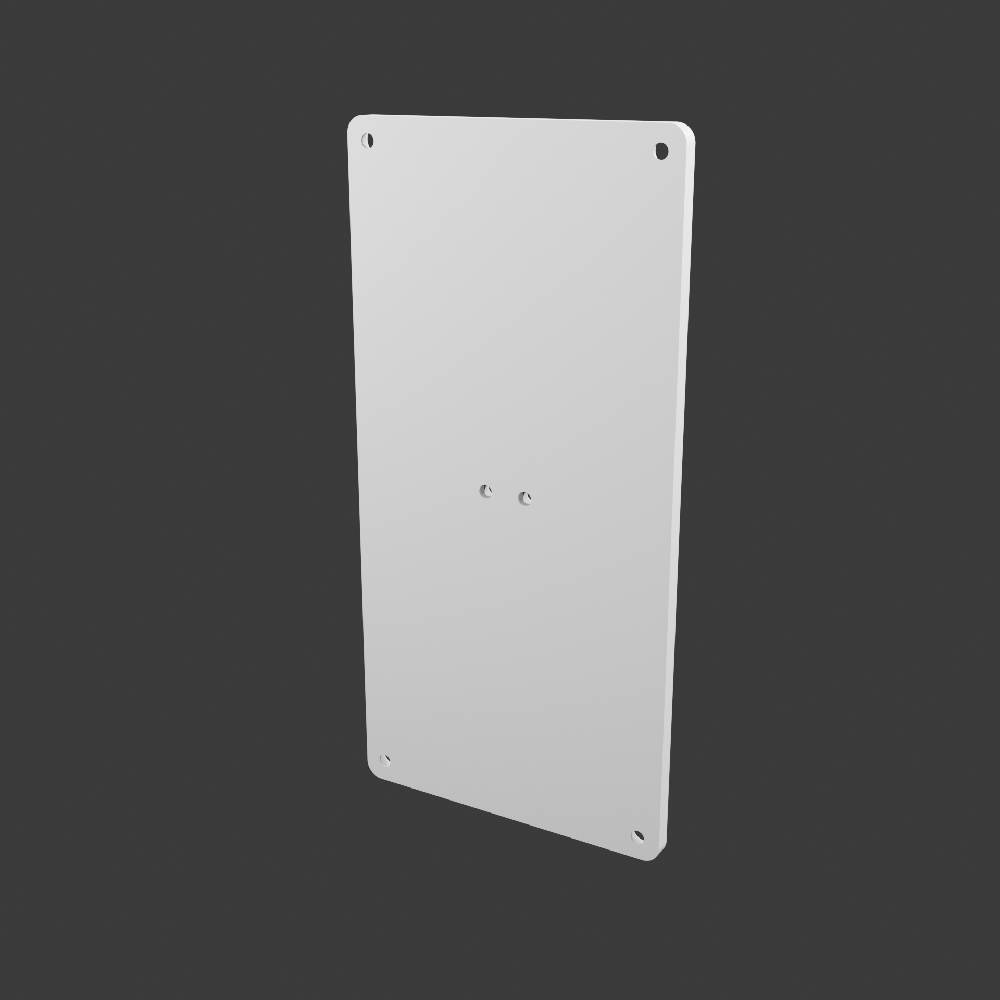
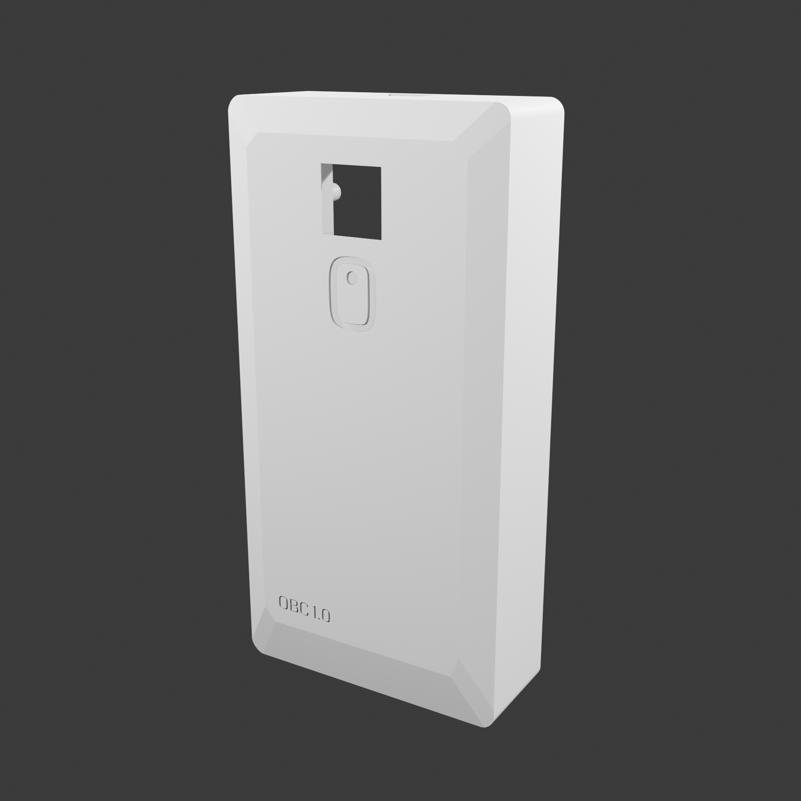
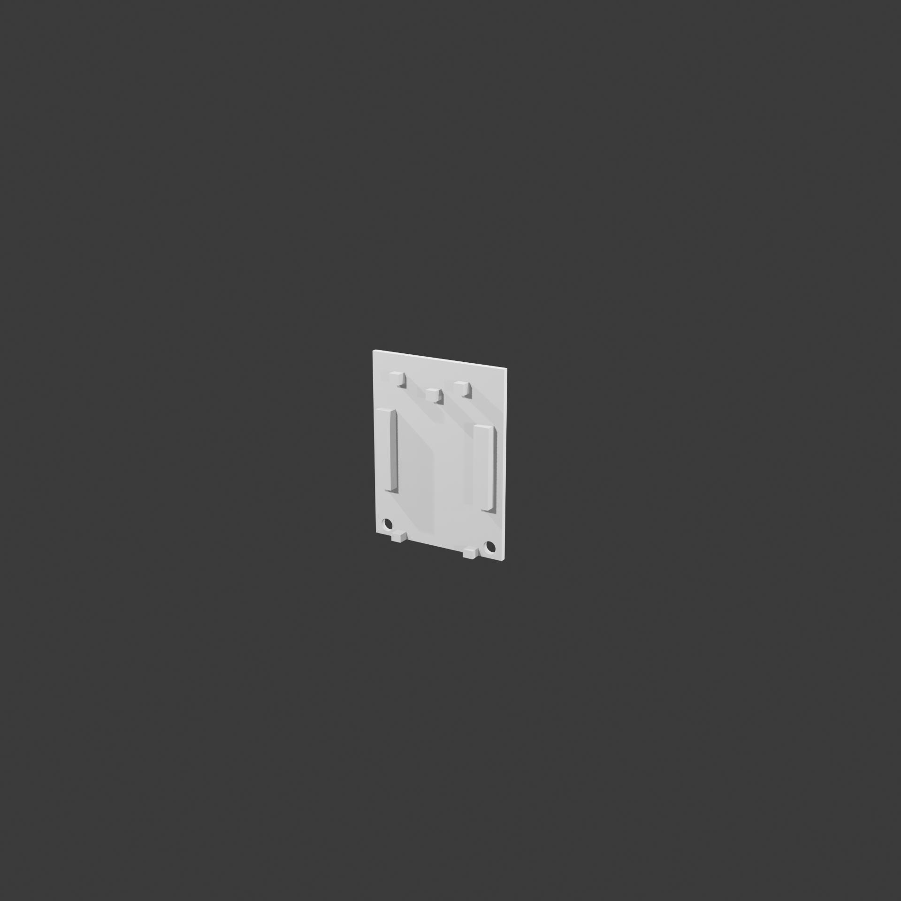
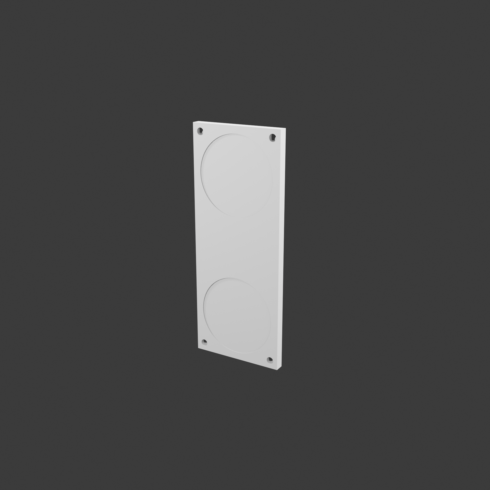
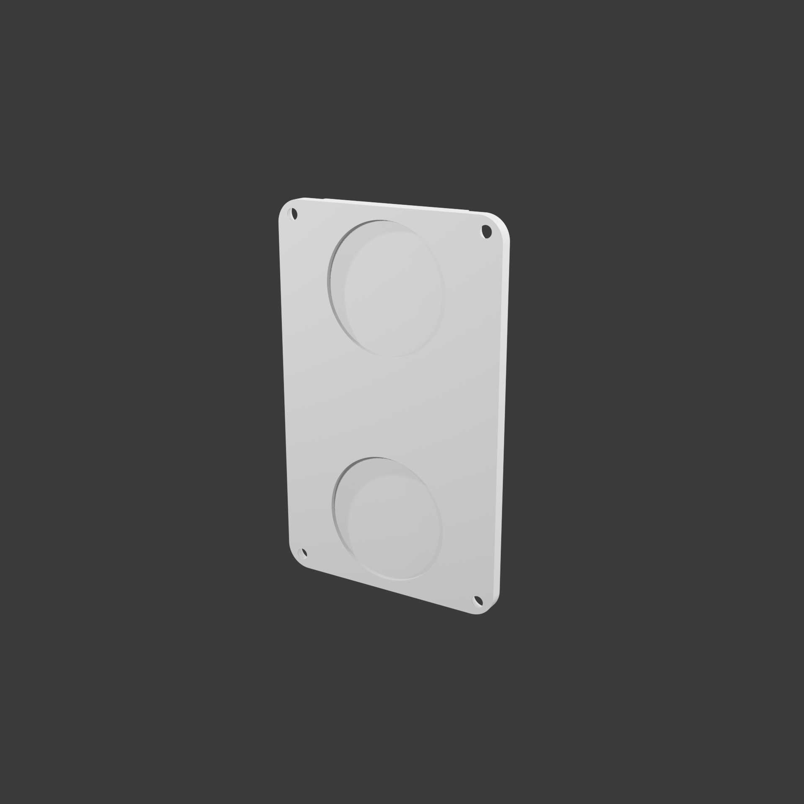
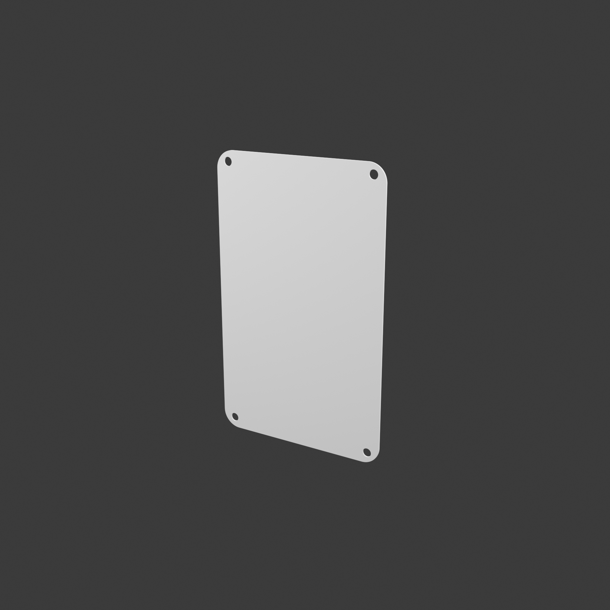
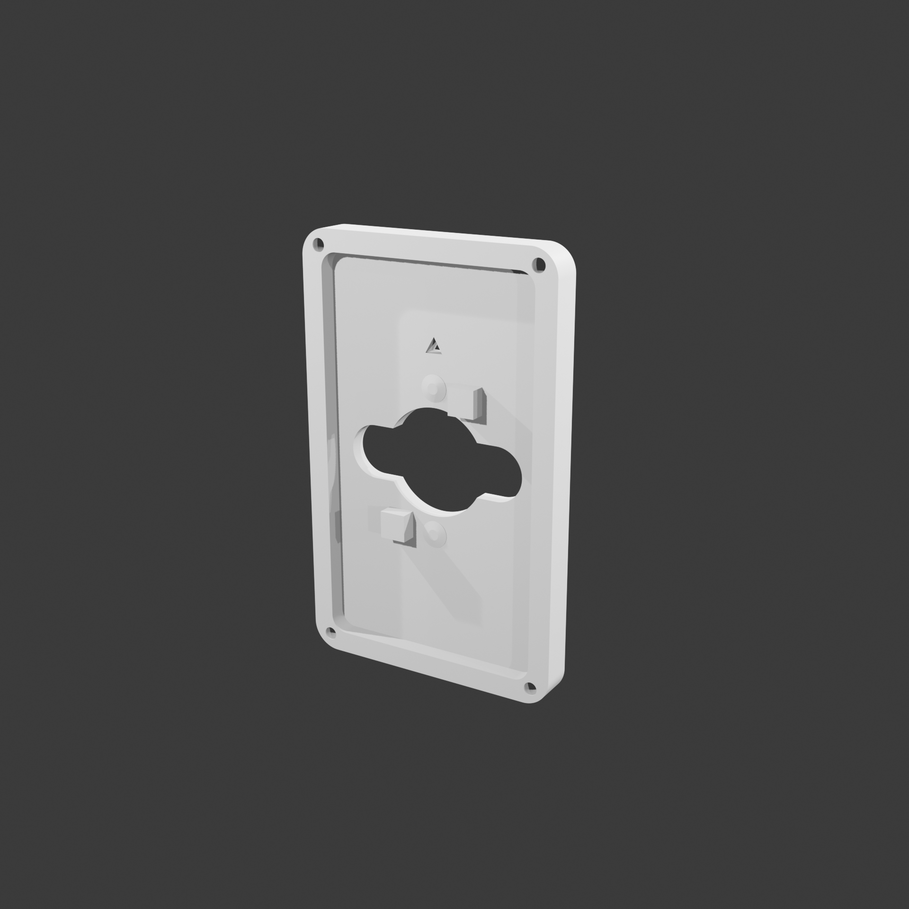
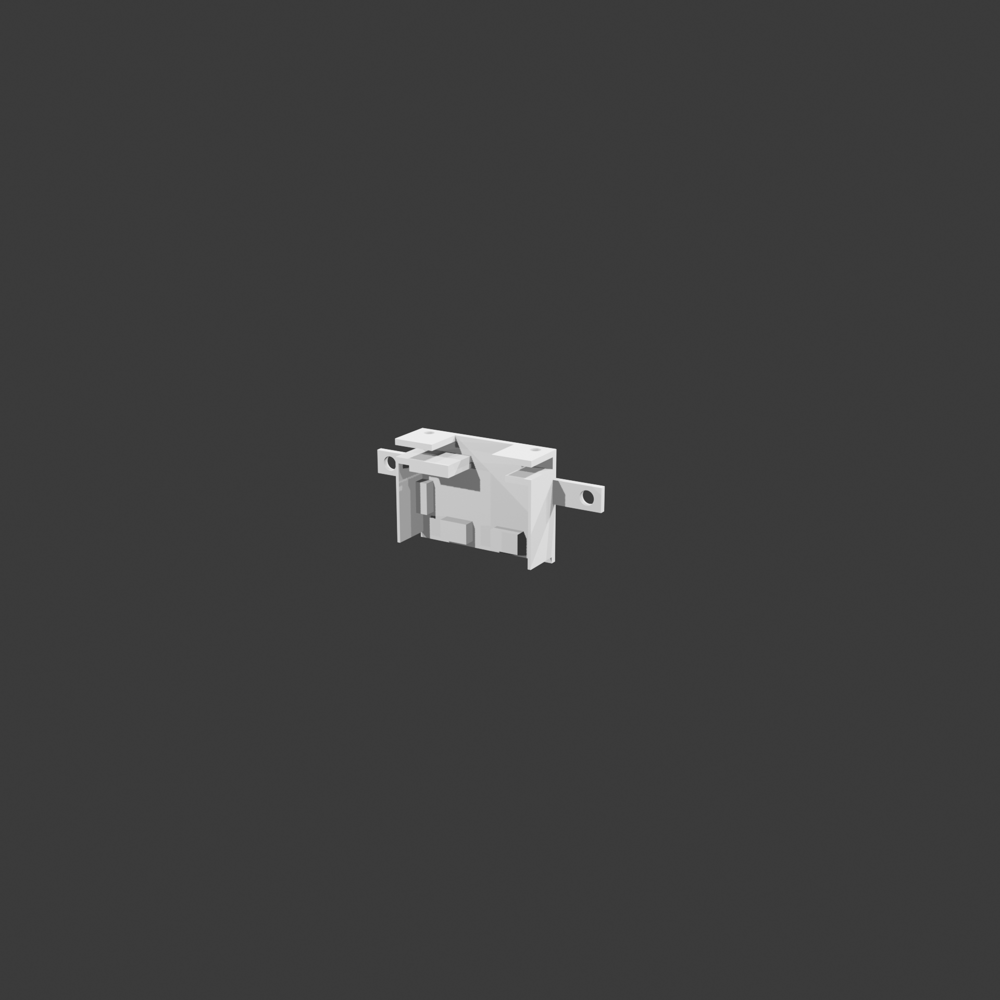

# Open Bodycam Enclosure HW-A1

## Overview
This is the first Bodycam enclosure released by Open Bodycam, work along with the [recorder software](https://github.com/Open-Bodycam/recorder-python) creating the ultimate open source Bodycam solution, built for transparency, for everyone.

Read the [release news](https://open-bodycam.xtl.tw/news?id=2603280101) for full release details.

## Build Guide
There's a build guide available [here](https://open-bodycam.xtl.tw/the-build).

## Parts List
|                     Image                      | Part Name                    | Part No.          |
| :--------------------------------------------: | :--------------------------- | :---------------- |
|        | Enclosure-Backplate-MH       | OBC-HW-A1-E-BP-MN |
|             | Enclosure-Unibody            | OBC-HW-A1-E-E-U   |
|   | Power Module-Charger-Holder  | OBC-HW-A1-PM-C    |
|                 | QD-Base-Cover                | OBC-HW-A1-QDB-C   |
|                  | QD-Base                      | OBC-HW-A1-QDB-B   |
|   | QD-Module-Magnet-Back-Cover  | OBC-HW-A1-QDM-BC  |
|  | QD-Module-Magnet-Inner-Layer | OBC-HW-A1-QDM-IL  |
|           | QD-Module-Magnet-QD          | OBC-HW-A1-QDM-B   |
|            | Switch-Module-Base           | OBC-HW-A1-SM-B    |
|          | Switch-Module-Switch         | OBC-HW-A1-SM-S    |